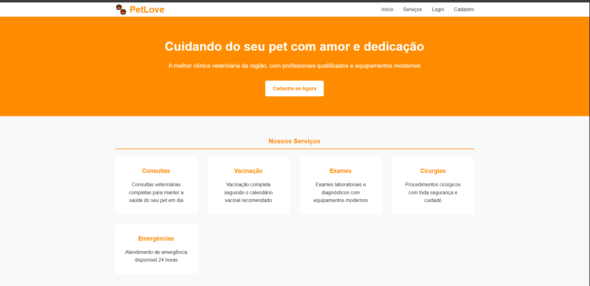
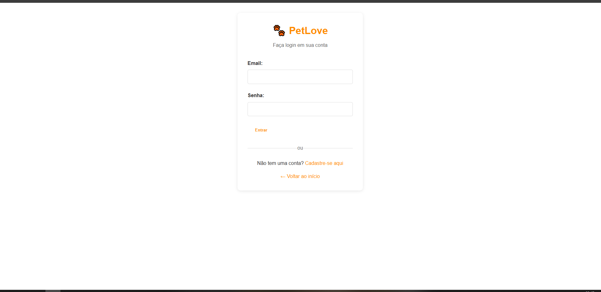
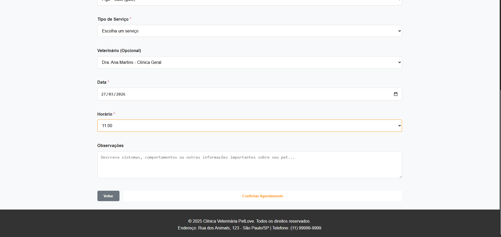
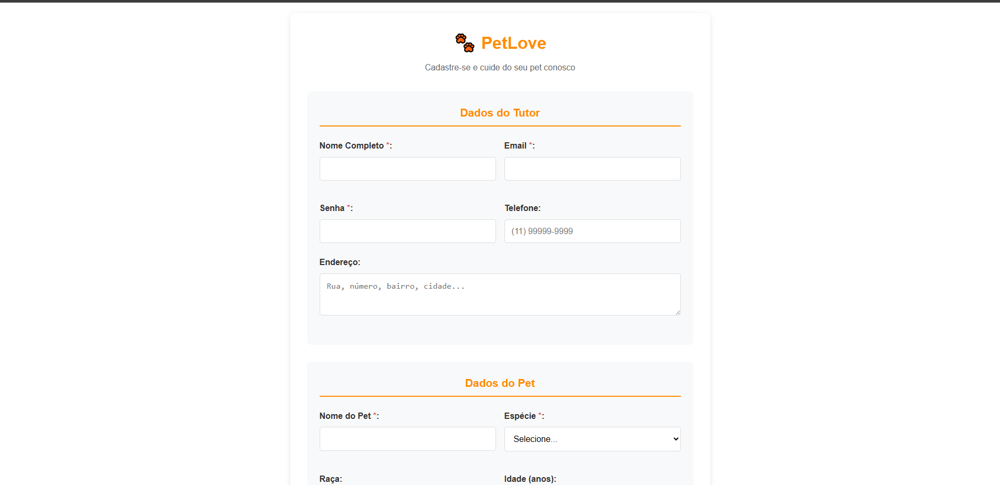
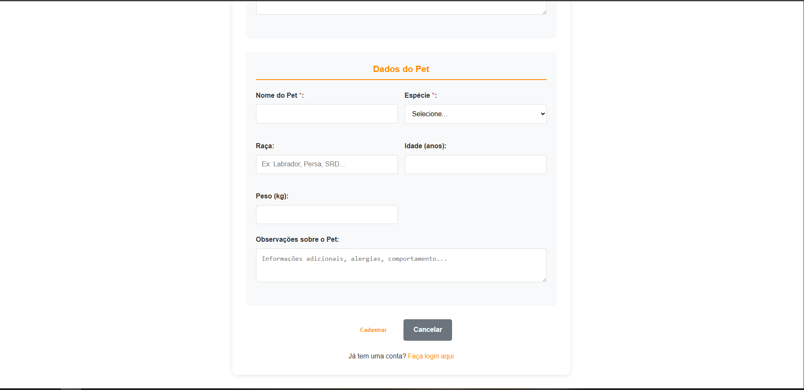

# PetLove - Sistema de Gerenciamento de Petshop

## Descrição
Aplicação web desenvolvida para gerenciamento de petshop, permitindo o controle de clientes, pets e agendamentos de serviços veterinários.
O sistema foi projetado com foco em organização, usabilidade e facilidade de execução, contando com criação automática do banco de dados.

---

## Tecnologias utilizadas
- PHP (PDO)
- MySQL / SQLite (fallback automático)
- JavaScript
- HTML5 e CSS3

---

## Funcionalidades
- Autenticação de usuários (login)
- Cadastro e gerenciamento de clientes
- Cadastro de pets vinculados aos clientes
- Agendamento de serviços veterinários
- Área dedicada para veterinários
- Criação automática do banco de dados

---

## Como executar o projeto
1. Clone este repositório
2. Mova a pasta para o diretório `htdocs` do XAMPP
3. Inicie o Apache no XAMPP
4. Acesse no navegador: http://localhost/Petlove-main
5. O banco de dados será criado automaticamente na primeira execução

---

## Demonstração do sistema
### Tela inicial

### Tela login

### Agendamento

### Tela cadastro

---

## Diferenciais do projeto
- Estrutura organizada seguindo padrão MVC
- Utilização de PDO com prepared statements
- Fallback automático para SQLite (dispensa configuração manual de banco)
- Criação automática de tabelas e dados iniciais

---

## Aprendizados
Este projeto permitiu o desenvolvimento de habilidades em:
- Estruturação de aplicações web
- Integração entre front-end e back-end
- Manipulação de banco de dados com segurança
- Organização de código e boas práticas
